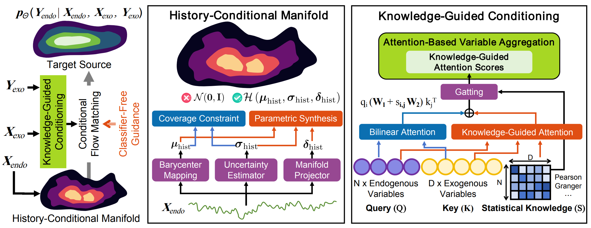

#  KITE: Knowledge-Guided Probabilistic Modeling for Time Series Forecasting with Exogenous Variables

[](https://www.python.org/)  [](https://pytorch.org/)

This code is the official PyTorch implementation of our paper, KITE: Knowledge-Guided Probabilistic Modeling for Time Series Forecasting with Exogenous Variables.

If you find this project helpful, please don't forget to give it a ⭐ Star to show your support. Thank you!


## Introduction
KITE, which performs Knowledge-Guided Probabilistic Modeling for time series forecasting with exogenous variables, aims to model covariate-conditioned predictive distributions by leveraging both historical and future exogenous information.

The framework builds upon Flow Matching and introduces a History-Conditional Manifold to construct an informative history-aware source distribution. Instead of starting generation from simple Gaussian noise, this module uses historical endogenous dynamics to initialize samples closer to the target forecasting space, thereby improving transport efficiency and probabilistic prediction quality.

Additionally, KITE introduces a Knowledge-Guided Conditioning module. It incorporates statistical knowledge into the attention mechanism to model dependencies between endogenous and exogenous variables, suppressing spurious covariate correlations during conditional generation. Furthermore, classifier-free guidance is adopted to flexibly balance covariate-agnostic and covariate-conditioned generation, enabling more robust and controllable forecasting.


<div align="center">

</div>

## Quickstart

> [!IMPORTANT]
> this project is fully tested under python 3.8, it is recommended that you set the Python version to 3.8.
1. Requirements

Given a python environment (**note**: this project is fully tested under python 3.8), install the dependencies with the following command:

```shell
pip install -r requirements.txt
```

2. Data preparation

You can obtained the well pre-processed datasets from [Google Drive](https://drive.google.com/file/d/1K2AvogpOpSz1PiQ53dPchzGv_PqlCWAK/view?usp=sharing). Then place the downloaded data under the folder `./dataset`. 

3. Train and evaluate model

- To see the model structure of KITE,  [click here](./ts_benchmark/baselines/kite/models/KITEModel.py).
- We provide all the experiment scripts for DAG and other baselines under the folder `./scripts/covariate_forecasting`.  For example you can reproduce all the experiment results as the following script:

```shell
sh ./scripts/w_future/KITE.sh
```
